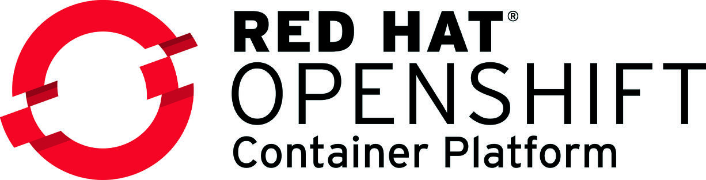

  

Notes on Openshift Container Platform and its differences from vanilla Kubernetes

## Openshift-Specific Resources:
- [Projects](https://docs.okd.io/latest/rest_api/project_apis/project-apis-index.html)
  - An OpenShift project is an alternative representation of a Kubernetes namespace. Projects are exposed as editable to end users while namespaces are not. Direct creation of a project is typically restricted to administrators, while end users should use the requestproject resource.
  - A project has one or more members, a quota on the resources that the project may consume, and the security controls on the resources in the project. Within a project, members may have different roles - project administrators can set membership, editors can create and manage the resources, and viewers can see but not access running containers. In a normal cluster project administrators are not able to alter their quotas - that is restricted to cluster administrators.
